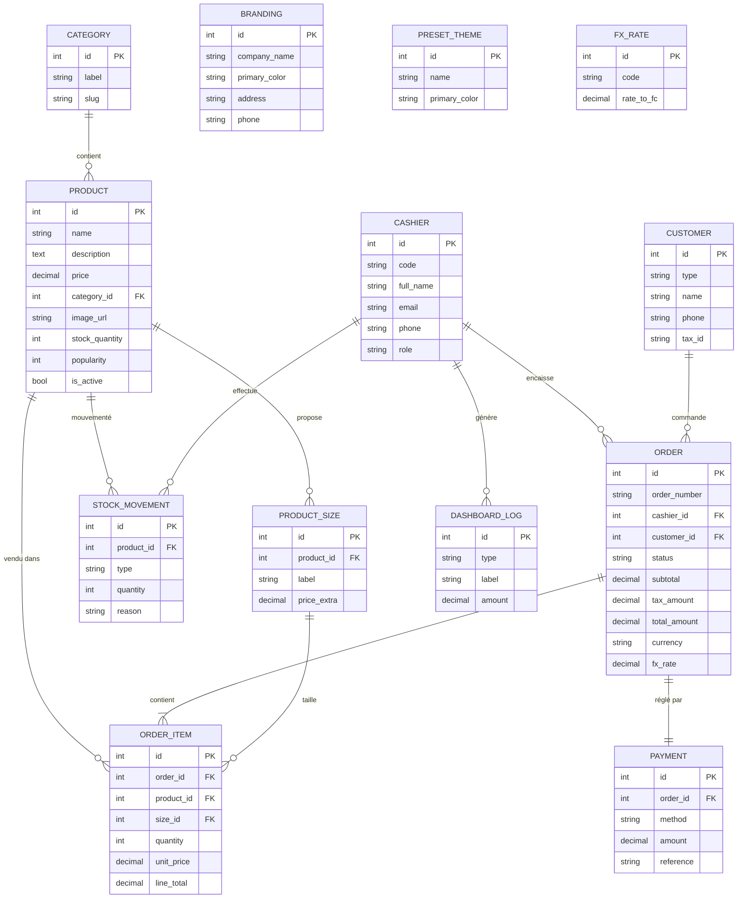

# Modélisation de Base de Données — POS BRIKIN

> Application : `pos-systeme-boissons`
> Stack : Next.js 16 · React 19 · TypeScript · TailwindCSS
> Contexte : Système de point de vente pour bar/café situé en RDC
> Société : **BRIKIN** — 03 Avenue Mbiloa / Ngaliema
> Devise : USD (affichage) / Franc Congolais (facture) — taux du jour

---

## 1. Analyse des besoins métier

L'analyse du code source (pages `pos`, `dashboard`, `menu`, `stock`, `reports`, `history` et composants `cart-panel`, `drink-card`, `branding-provider`) révèle les **entités métier** suivantes :

| #   | Entité               | Source dans le code                                           |
| --- | -------------------- | ------------------------------------------------------------- |
| 1   | Catégorie de boisson | `lib/data.ts` (`categories[]`), `lib/types.ts` (`CategoryId`) |
| 2   | Boisson / Produit    | `lib/data.ts` (`drinks[]`), `lib/types.ts` (`Drink`)          |
| 3   | Taille de produit    | `lib/types.ts` (`Drink.sizes?: string[]`), `drink-card.tsx`   |
| 4   | Panier (session)     | `pos-app.tsx` (`cart` state), `lib/types.ts` (`CartItem`)     |
| 5   | Commande / Facture   | `cart-panel.tsx` (Dialog de facture), `history/page.tsx`      |
| 6   | Ligne de commande    | `cart-panel.tsx` (mapping `items`)                            |
| 7   | Paiement             | `cart-panel.tsx` (`paymentMethods`, `Espèces`)                |
| 8   | Caissier / Vendeur   | `cart-panel.tsx` (« Vendeur: cesar », « AF666 »)              |
| 9   | Client               | `cart-panel.tsx` (« Client: NULL », « Personne Physique »)    |
| 10  | Société (Branding)   | `branding-provider.tsx` (`Branding`)                          |
| 11  | Thème de couleurs    | `lib/data.ts` (`presetThemes[]`)                              |
| 12  | Taux de change       | `cart-panel.tsx` (`FX_RATE = 2289.3077`)                      |
| 13  | Mouvement de stock   | `stock/page.tsx` (alerte `stock <= 15`)                       |
| 14  | Activité (dashboard) | `dashboard/page.tsx` (« Order placed », « Discount applied ») |

---

## 2. Modèle Conceptuel de Données (MCD)

```
┌──────────────────┐         ┌──────────────────┐         ┌──────────────────┐
│    CATEGORY      │ 1     N │     PRODUCT      │ 1     N │     SIZE         │
│──────────────────│────────▶│──────────────────│────────▶│──────────────────│
│ id (PK)          │         │ id (PK)          │         │ id (PK)          │
│ label            │         │ name             │         │ label (S, M, L)  │
│ slug             │         │ description      │         │ product_id (FK)  │
│ created_at       │         │ price            │         │ price_extra      │
└──────────────────┘         │ category_id (FK) │         └──────────────────┘
                             │ image_url        │
                             │ stock_quantity   │
                             │ popularity       │
                             │ is_active        │
                             │ created_at       │
                             │ updated_at       │
                             └────────┬─────────┘
                                      │ 1
                                      │
                                      │ N
                             ┌────────▼─────────┐
┌──────────────────┐  1    N │   ORDER_ITEM     │  N    1  ┌──────────────────┐
│     ORDER        │────────▶│──────────────────│◀─────────│    CASHIER       │
│──────────────────│         │ id (PK)          │          │──────────────────│
│ id (PK)          │         │ order_id (FK)    │          │ id (PK)          │
│ order_number     │         │ product_id (FK)  │          │ code (AF666)     │
│ cashier_id (FK)  │         │ size_id (FK)     │          │ full_name        │
│ customer_id (FK) │         │ quantity         │          │ email            │
│ status (enum)    │         │ unit_price       │          │ phone            │
│ subtotal         │         │ line_total       │          │ role             │
│ tax_rate         │         └──────────────────┘          │ is_active        │
│ tax_amount       │                                      └──────────────────┘
│ total_amount     │
│ currency         │         ┌──────────────────┐
│ fx_rate          │  1    1 │    PAYMENT       │
│ payment_method   │────────▶│──────────────────│
│ paid_at          │         │ id (PK)          │
│ created_at       │         │ order_id (FK)    │
└────────┬─────────┘         │ method (enum)    │
         │ 1                 │ amount           │
         │                   │ reference        │
         │ N                 │ paid_at          │
┌────────▼─────────┐         └──────────────────┘
│    CUSTOMER      │
│──────────────────│
│ id (PK)          │         ┌──────────────────┐
│ type (enum)      │         │   STOCK_MOVEMENT │
│ name             │         │──────────────────│
│ phone            │         │ id (PK)          │
│ email            │         │ product_id (FK)  │
│ tax_id           │         │ type (IN/OUT)    │
│ created_at       │         │ quantity         │
└──────────────────┘         │ reason           │
                             │ user_id (FK)     │
┌──────────────────┐         │ created_at       │
│    BRANDING      │         └──────────────────┘
│──────────────────│
│ id (PK)          │         ┌──────────────────┐
│ company_name     │         │   DASHBOARD_LOG  │
│ tagline          │         │──────────────────│
│ logo_text        │         │ id (PK)          │
│ primary_color    │         │ type (event)     │
│ secondary_color  │         │ label            │
│ id_nat           │         │ amount           │
│ rccm             │         │ created_at       │
│ tax_number       │         └──────────────────┘
│ address          │
│ phone            │         ┌──────────────────┐
│ email            │         │   PRESET_THEME   │
│ updated_at       │         │──────────────────│
└──────────────────┘         │ id (PK)          │
                             │ name             │
┌──────────────────┐         │ primary_color    │
│    FX_RATE       │         │ secondary_color  │
│──────────────────│         └──────────────────┘
│ id (PK)          │
│ code (USD)       │
│ rate_to_fc       │
│ effective_at     │
└──────────────────┘
```

### Cardinalités résumées

- `CATEGORY (1) — (N) PRODUCT`
- `PRODUCT (1) — (N) SIZE`
- `PRODUCT (1) — (N) ORDER_ITEM`
- `SIZE (1) — (N) ORDER_ITEM` (optionnelle)
- `CASHIER (1) — (N) ORDER`
- `CUSTOMER (1) — (N) ORDER` (optionnelle — ventes anonymes)
- `ORDER (1) — (1) PAYMENT`
- `PRODUCT (1) — (N) STOCK_MOVEMENT`
- `BRANDING (1) — (1)` (singleton — configuration globale)

---

## 3. Modèle Logique de Données (MLD) — SQL (PostgreSQL)

```sql
-- ============================================================
-- POS BRIKIN — Schéma de base de données
-- Cible : PostgreSQL 15+  (adaptable à MySQL / SQLite)
-- ============================================================

-- =========================
-- ENUMS
-- =========================
CREATE TYPE order_status     AS ENUM ('draft', 'paid', 'refunded', 'cancelled', 'pending');
CREATE TYPE payment_method   AS ENUM ('cash', 'card', 'mobile', 'other');
CREATE TYPE customer_type    AS ENUM ('person', 'company');
CREATE TYPE stock_movement   AS ENUM ('in', 'out', 'adjustment');
CREATE TYPE cashier_role     AS ENUM ('cashier', 'manager', 'admin');
CREATE TYPE log_event_type   AS ENUM ('order_placed', 'payment_received', 'discount_applied', 'refund', 'stock_adjustment');

-- =========================
-- RÉFÉRENTIELS
-- =========================
CREATE TABLE category (
    id          SERIAL PRIMARY KEY,
    label       VARCHAR(50)  NOT NULL UNIQUE,    -- ex: 'Whiskies'
    slug        VARCHAR(50)  NOT NULL UNIQUE,    -- ex: 'whiskies'
    created_at  TIMESTAMPTZ  NOT NULL DEFAULT NOW()
);

CREATE TABLE product (
    id              SERIAL PRIMARY KEY,
    name            VARCHAR(150) NOT NULL,
    description     TEXT         NOT NULL DEFAULT '',
    price           NUMERIC(12,2) NOT NULL CHECK (price >= 0),
    category_id     INT          NOT NULL REFERENCES category(id) ON DELETE RESTRICT,
    image_url       TEXT         NOT NULL DEFAULT '/drinks/placeholder.png',
    stock_quantity  INT          NOT NULL DEFAULT 0 CHECK (stock_quantity >= 0),
    popularity      INT          NOT NULL DEFAULT 0,
    is_active       BOOLEAN      NOT NULL DEFAULT TRUE,
    created_at      TIMESTAMPTZ  NOT NULL DEFAULT NOW(),
    updated_at      TIMESTAMPTZ  NOT NULL DEFAULT NOW()
);
CREATE INDEX idx_product_category ON product(category_id);
CREATE INDEX idx_product_lowstock ON product(stock_quantity) WHERE stock_quantity <= 15;

CREATE TABLE product_size (
    id           SERIAL PRIMARY KEY,
    product_id   INT          NOT NULL REFERENCES product(id) ON DELETE CASCADE,
    label        VARCHAR(20)  NOT NULL,    -- 'S', 'M', 'L', '50cl', '75cl', '1L'
    price_extra  NUMERIC(12,2) NOT NULL DEFAULT 0,  -- surcharge par rapport au prix de base
    UNIQUE (product_id, label)
);

-- =========================
-- UTILISATEURS & CLIENTS
-- =========================
CREATE TABLE cashier (
    id          SERIAL PRIMARY KEY,
    code        VARCHAR(20)  NOT NULL UNIQUE,    -- ex: 'AF666'
    full_name   VARCHAR(120) NOT NULL,
    email       VARCHAR(150) UNIQUE,
    phone       VARCHAR(30),
    role        cashier_role NOT NULL DEFAULT 'cashier',
    avatar_url  TEXT,
    is_active   BOOLEAN      NOT NULL DEFAULT TRUE,
    created_at  TIMESTAMPTZ  NOT NULL DEFAULT NOW()
);

CREATE TABLE customer (
    id          SERIAL PRIMARY KEY,
    type        customer_type NOT NULL DEFAULT 'person',
    name        VARCHAR(150) NOT NULL,
    phone       VARCHAR(30),
    email       VARCHAR(150),
    tax_id      VARCHAR(50),                    -- N° impôt pour les entreprises
    address     TEXT,
    created_at  TIMESTAMPTZ  NOT NULL DEFAULT NOW()
);

-- =========================
-- COMMANDES & PAIEMENTS
-- =========================
CREATE TABLE "order" (
    id              SERIAL PRIMARY KEY,
    order_number    VARCHAR(20)  NOT NULL UNIQUE,    -- ex: 'ORD-10291'
    cashier_id      INT          NOT NULL REFERENCES cashier(id) ON DELETE RESTRICT,
    customer_id     INT          REFERENCES customer(id) ON DELETE SET NULL,
    status          order_status NOT NULL DEFAULT 'pending',
    subtotal        NUMERIC(12,2) NOT NULL DEFAULT 0,
    tax_rate        NUMERIC(5,4)  NOT NULL DEFAULT 0.05,
    tax_amount      NUMERIC(12,2) NOT NULL DEFAULT 0,
    total_amount    NUMERIC(12,2) NOT NULL DEFAULT 0,
    currency        VARCHAR(3)   NOT NULL DEFAULT 'USD',
    fx_rate         NUMERIC(12,4) NOT NULL DEFAULT 2289.3077,
    created_at      TIMESTAMPTZ  NOT NULL DEFAULT NOW(),
    paid_at         TIMESTAMPTZ
);
CREATE INDEX idx_order_status  ON "order"(status);
CREATE INDEX idx_order_created ON "order"(created_at DESC);
CREATE INDEX idx_order_cashier ON "order"(cashier_id);

CREATE TABLE order_item (
    id           SERIAL PRIMARY KEY,
    order_id     INT          NOT NULL REFERENCES "order"(id) ON DELETE CASCADE,
    product_id   INT          NOT NULL REFERENCES product(id) ON DELETE RESTRICT,
    size_id      INT          REFERENCES product_size(id) ON DELETE SET NULL,
    quantity     INT          NOT NULL CHECK (quantity > 0),
    unit_price   NUMERIC(12,2) NOT NULL,    -- prix gelé au moment de la vente
    line_total   NUMERIC(12,2) NOT NULL,    -- quantity * unit_price
    position     INT          NOT NULL DEFAULT 0
);
CREATE INDEX idx_orderitem_order   ON order_item(order_id);
CREATE INDEX idx_orderitem_product ON order_item(product_id);

CREATE TABLE payment (
    id           SERIAL PRIMARY KEY,
    order_id     INT          NOT NULL UNIQUE REFERENCES "order"(id) ON DELETE CASCADE,
    method       payment_method NOT NULL,
    amount       NUMERIC(12,2) NOT NULL,
    reference    VARCHAR(120),              -- n° transaction mobile money, etc.
    paid_at      TIMESTAMPTZ  NOT NULL DEFAULT NOW()
);

-- =========================
-- STOCK
-- =========================
CREATE TABLE stock_movement (
    id          SERIAL PRIMARY KEY,
    product_id  INT          NOT NULL REFERENCES product(id) ON DELETE CASCADE,
    type        stock_movement NOT NULL,
    quantity    INT          NOT NULL,                -- signé : + pour IN, - pour OUT
    reason      VARCHAR(255),
    user_id     INT          REFERENCES cashier(id) ON DELETE SET NULL,
    created_at  TIMESTAMPTZ  NOT NULL DEFAULT NOW()
);
CREATE INDEX idx_stockmove_product ON stock_movement(product_id, created_at DESC);

-- =========================
-- CONFIGURATION / BRANDING
-- =========================
CREATE TABLE branding (
    id              INT PRIMARY KEY DEFAULT 1 CHECK (id = 1), -- singleton
    company_name    VARCHAR(120) NOT NULL DEFAULT 'BRIKIN',
    tagline         VARCHAR(200) NOT NULL DEFAULT 'Specialty drinks & more',
    logo_text       VARCHAR(6)   NOT NULL DEFAULT 'P',
    primary_color   VARCHAR(7)   NOT NULL DEFAULT '#f6905f',
    secondary_color VARCHAR(7)   NOT NULL DEFAULT '#fdebe1',
    id_nat          VARCHAR(50)  NOT NULL DEFAULT '01-G4701-N25076X',
    rccm            VARCHAR(50)  NOT NULL DEFAULT 'CD/KNG/RCCM/17-A-03542',
    tax_number      VARCHAR(50)  NOT NULL DEFAULT 'A1720894F',
    address         TEXT         NOT NULL DEFAULT '03 Avenue Mbiloa / Ngaliema',
    phone           VARCHAR(50)  NOT NULL DEFAULT '+243974763940 / 819648854',
    email           VARCHAR(150) NOT NULL DEFAULT 'zuiya.mambula@gmail.com',
    updated_at      TIMESTAMPTZ  NOT NULL DEFAULT NOW()
);

CREATE TABLE preset_theme (
    id              SERIAL PRIMARY KEY,
    name            VARCHAR(50)  NOT NULL UNIQUE,   -- 'Royal Gold', 'Emerald', ...
    primary_color   VARCHAR(7)   NOT NULL,
    secondary_color VARCHAR(7)   NOT NULL
);

-- =========================
-- TAUX DE CHANGE
-- =========================
CREATE TABLE fx_rate (
    id            SERIAL PRIMARY KEY,
    code          VARCHAR(3)   NOT NULL,            -- 'USD'
    rate_to_fc    NUMERIC(14,4) NOT NULL,           -- 1 USD = 2289.3077 FC
    effective_at  TIMESTAMPTZ  NOT NULL DEFAULT NOW(),
    created_at    TIMESTAMPTZ  NOT NULL DEFAULT NOW()
);
CREATE INDEX idx_fxrate_code ON fx_rate(code, effective_at DESC);

-- =========================
-- LOG DASHBOARD (audit léger)
-- =========================
CREATE TABLE dashboard_log (
    id          SERIAL PRIMARY KEY,
    type        log_event_type NOT NULL,
    label       VARCHAR(150) NOT NULL,
    amount      NUMERIC(12,2),
    ref_id      INT,                              -- ex: order_id
    created_at  TIMESTAMPTZ  NOT NULL DEFAULT NOW()
);
CREATE INDEX idx_dashboardlog_created ON dashboard_log(created_at DESC);

-- =========================
-- TRIGGER : décrémenter le stock à chaque vente payée
-- =========================
CREATE OR REPLACE FUNCTION trg_decrement_stock_on_payment()
RETURNS TRIGGER AS $$
BEGIN
    IF NEW.status = 'paid' AND (OLD.status IS NULL OR OLD.status <> 'paid') THEN
        UPDATE product p
           SET stock_quantity = p.stock_quantity - oi.quantity,
               updated_at     = NOW()
          FROM order_item oi
         WHERE oi.order_id  = NEW.id
           AND oi.product_id = p.id;

        INSERT INTO stock_movement(product_id, type, quantity, reason, user_id)
        SELECT oi.product_id, 'out', oi.quantity, 'Vente ' || NEW.order_number, NEW.cashier_id
          FROM order_item oi
         WHERE oi.order_id = NEW.id;
    END IF;
    RETURN NEW;
END;
$$ LANGUAGE plpgsql;

CREATE TRIGGER order_paid_decrement_stock
AFTER UPDATE OF status ON "order"
FOR EACH ROW EXECUTE FUNCTION trg_decrement_stock_on_payment();

-- =========================
-- TRIGGER : updated_at automatique
-- =========================
CREATE OR REPLACE FUNCTION set_updated_at() RETURNS TRIGGER AS $$
BEGIN NEW.updated_at = NOW(); RETURN NEW; END;
$$ LANGUAGE plpgsql;

CREATE TRIGGER product_updated_at  BEFORE UPDATE ON product
FOR EACH ROW EXECUTE FUNCTION set_updated_at();
CREATE TRIGGER branding_updated_at BEFORE UPDATE ON branding
FOR EACH ROW EXECUTE FUNCTION set_updated_at();

-- =========================
-- VUES UTILES
-- =========================
CREATE VIEW v_top_sellers AS
SELECT p.id, p.name, SUM(oi.quantity) AS total_sold, SUM(oi.line_total) AS revenue
  FROM order_item oi
  JOIN product p ON p.id = oi.product_id
  JOIN "order" o ON o.id = oi.order_id
 WHERE o.status = 'paid'
 GROUP BY p.id, p.name
 ORDER BY total_sold DESC;

CREATE VIEW v_sales_by_day AS
SELECT DATE(o.created_at) AS day, COUNT(*) AS orders_count, SUM(o.total_amount) AS total
  FROM "order" o
 WHERE o.status = 'paid'
 GROUP BY DATE(o.created_at)
 ORDER BY day DESC;

CREATE VIEW v_low_stock AS
SELECT id, name, stock_quantity FROM product WHERE stock_quantity <= 15 AND is_active = TRUE;
```

---

## 4. Diagramme Entité-Relation (Mermaid)



---

## 5. Jeu de données d'amorçage (extrait fidèle au code)

```sql
-- Catégories (extrait de lib/data.ts)
INSERT INTO category (label, slug) VALUES
 ('All', 'all'), ('Water', 'water'), ('Energy', 'energy'),
 ('Whiskies', 'whiskies'), ('Vins', 'vins'), ('Champagnes', 'champagnes'),
 ('Vodka', 'vodka'), ('Cognacs', 'cognacs'), ('Tequilas', 'tequilas'),
 ('Liqueurs', 'liqueurs'), ('Bières', 'bieres'), ('Soft', 'soft');

-- Vendeur (Albert Flores / "cesar" sur la facture)
INSERT INTO cashier (code, full_name, email, role, avatar_url) VALUES
 ('AF666', 'Albert Flores', NULL, 'cashier', '/cashier-avatar.png'),
 ('CESAR', 'cesar', NULL, 'cashier', NULL);

-- Thèmes prédéfinis
INSERT INTO preset_theme (name, primary_color, secondary_color) VALUES
 ('Royal Gold',    '#D4AF37', '#FFF8E1'),
 ('Emerald',       '#10B981', '#D1FAE5'),
 ('Ruby Lounge',   '#B91C1C', '#FEE2E2'),
 ('Champagne',     '#EAB308', '#FEF9C3'),
 ('Royal Purple',  '#7C3AED', '#EDE9FE'),
 ('Sapphire',      '#2563EB', '#DBEAFE'),
 ('Copper',        '#B45309', '#FEF3C7'),
 ('Rose Gold',     '#BE5672', '#FCE7F3'),
 ('Obsidian',      '#111827', '#F3F4F6');

-- Branding par défaut (BRIKIN)
INSERT INTO branding (id, company_name, tagline, logo_text, primary_color)
VALUES (1, 'BRIKIN', 'Specialty drinks & more', 'P', '#f6905f');

-- Taux de change
INSERT INTO fx_rate (code, rate_to_fc) VALUES ('USD', 2289.3077);
```

---

## 6. Règles métier dérivées du code

| Règle                                 | Constante / Source                                           | Implémentation                                   |
| ------------------------------------- | ------------------------------------------------------------ | ------------------------------------------------ |
| TVA par défaut                        | `TAX_RATE = 0.05` (`cart-panel.tsx`)                         | Colonne `tax_rate` sur `order`                   |
| Taux de change                        | `FX_RATE = 2289.3077` (`cart-panel.tsx`)                     | Table `fx_rate` historisée                       |
| Seuil stock bas                       | `d.stock <= 15` (`drink-card.tsx`, `stock/page.tsx`)         | Index partiel + vue `v_low_stock`                |
| Annulation des quantités nulles       | `.filter(i => i.quantity > 0)` (`pos-app.tsx`)               | Contrainte `CHECK quantity > 0`                  |
| Unicité (produit, taille) dans panier | `i.drink.id === drink.id && i.size === size` (`pos-app.tsx`) | `UNIQUE(order_id, product_id, size_id)` possible |
| Modes de paiement                     | `cash`, `card`, `mobile` (`cart-panel.tsx`)                  | ENUM `payment_method`                            |
| Branding = singleton                  | `defaultBranding` (`branding-provider.tsx`)                  | `CHECK (id = 1)`                                 |
| Devise affichage                      | `${total.toFixed(2)}` USD, `Fc` sur facture                  | Colonne `currency` + `fx_rate`                   |

---

## 7. Évolutions recommandées

1. **Authentification** (manquante) → table `user_account` liée à `cashier` (login, mot de passe hashé, sessions).
2. **Remises / discounts** (commenté `// Discount feature removed`) → table `discount` + `order_item.discount_id`.
3. **Tables / salle** (commenté `// Order mode removed`) → tables `table` + `order.table_id`.
4. **Fournisseurs & réceptions de stock** → tables `supplier`, `purchase_order`, `purchase_order_item`.
5. **Multi-boutiques** → table `shop` + clé étrangère sur toutes les tables transactionnelles.
6. **Audit complet** (qui a modifié quoi) → table `audit_log` générique.
7. **Sauvegarde de la facture** → table `invoice` (numéro fiscal, hash PDF, lien S3).

---

_Document généré à partir de l'analyse statique du code source de `pos-systeme-boissons` (Next.js / React / TypeScript)._
